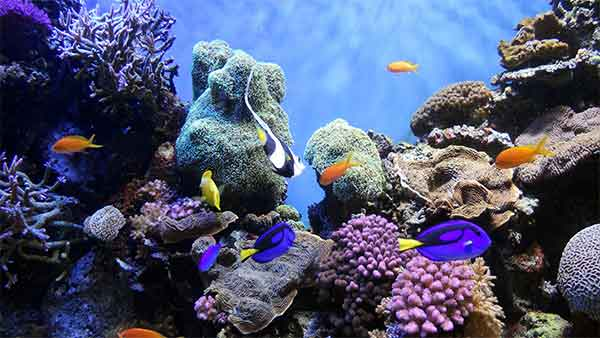
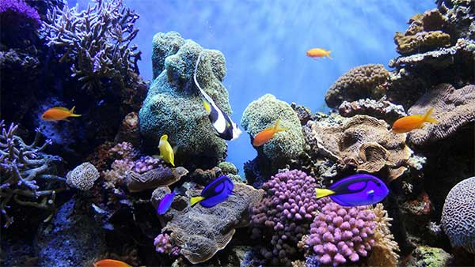

<!DOCTYPE html>
<html lang="en">
  <head>
    <meta charset="UTF-8" />
    <title>Web Images</title>
  </head>

  <body>

   <h1>Web Images</h1>

   
Original Image: 1.9MB

   
   
Low quality (10%). File size:29.89k 

   
   
Medium quality (30%). File size:47.36k 

   
   
High quality (60%). File size:91.67k 

   
   
Very quality (80%). File size:154k 

   
   
Maximum quality (100%). File size:299.8k 

  </body>
</html>
